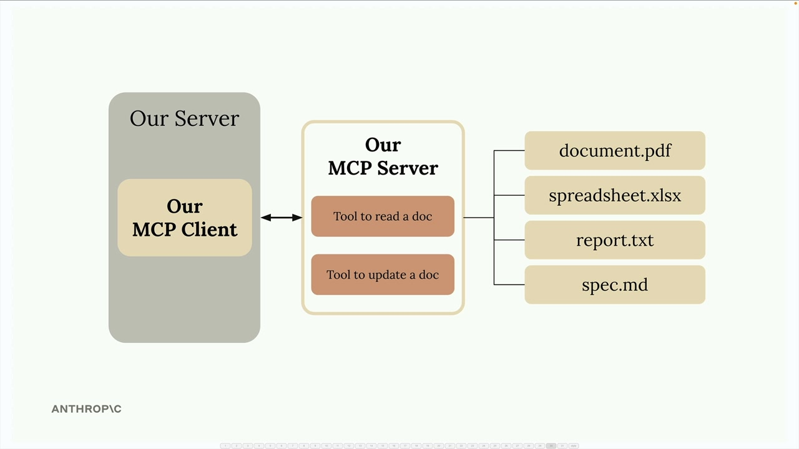

## Project setup

#### Downloads

- [cli_project.zip(opens in new tab)](https://cc.sj-cdn.net/instructor/4hdejjwplbrm-anthropic/assets/1762981524/cli_project.zip?response-content-disposition=attachment&Expires=1779048572&Signature=FdCcLfcNaNg3vnmWEC2beYUxx5RFiFqvubAzKYx5UVXQUmj98iFrUiYPMtTYQpbQxMTZUP5TLKiqBdV3Uz1JFK8Drl8UboXqiPh8gGmQ5dqlkk-3TQkE4KwS3m5PL9Csmo2YwXRMjrHNQLZhbCACt0JBxIRUZU168Tig2rU2wQmw73HtbjPaEATbiP4pz9z7GO9pXVKdEz5FHnvq3qiifR2nEvpJO0hdzIV4sZJZS0fKU3MiRbzWU3PhcYROLRQihh9dCQmWIUzl7ReTtFTzTgI2HtLPR66TfMGXJWODlFk8EGpHbxu0XVqQes2WZ7dyvGu1~RzbPpgVs8-Iimt5cA__&Key-Pair-Id=APKAI3B7HFD2VYJQK4MQ)
- [cli_project_COMPLETE.zip](https://cc.sj-cdn.net/instructor/4hdejjwplbrm-anthropic/assets/1762981524/cli_project_COMPLETE.zip?response-content-disposition=attachment&Expires=1779048572&Signature=JfSH2KGojSmuEuvCFLIaNQzGPk1y-2rLkKVdNdBKKB9sCj66mbkLCMDAkQle8g2S-yb0ELSreWe4njmrBhGUqV6yWyi648yYDZIB~mm3anaEdB3H3QF3FLzWE6Yf4yxxAw7zwByl-ZDQXsFJlOlQO0Q8TdCPKRP0-UmvFwF7hw2-3UZLsMsU~YOxXWDNsRLPpZu8YZcQSGZhzaenjtrhjkO5IP6IlW5vGVGm9w9fsU6CqnOWgIgwbgtJ464Bpl62oXAtJuOZWkkWfndEiwdTD51SGH6eCvbdVxGM1Z4P7SV9ZJCEiGXZIUdan8Nj1ASovm1CZSsMDRYGSbJpsS8DxA__&Key-Pair-Id=APKAI3B7HFD2VYJQK4MQ)

We're going to build a CLI-based chatbot to better understand how MCP clients and servers work together. This hands-on project will give you practical experience with both sides of the MCP architecture.

## What We're Building

Our chatbot will allow users to interact with a collection of documents through a command-line interface. The system consists of two main components:

- An MCP client that handles user interactions
- A custom MCP server that manages document operations



The server will provide two essential tools: one for reading document contents and another for updating them. All documents will be stored in memory for simplicity - no database required.

## Important Architecture Note

In real-world projects, you typically implement either an MCP client or an MCP server, not both. You might create:

- An MCP server to expose your service to other developers
- An MCP client to connect to existing MCP servers


We're building both components in this project purely for educational purposes - to understand how they communicate and work together.

## Project Setup

Download the `cli_project.zip` file attached to this lesson and extract it to your preferred development directory. Open your code editor in the project folder.

The project includes a comprehensive README file with setup instructions. Follow these steps:

1. Add your Anthropic API key to the `.env` file
2. Install dependencies using either UV (recommended) or pip
3. Run the starter application to verify everything works

## Running the Application

Navigate to your project directory in the terminal. You'll see the main project files including `main.py`, `mcp_client.py`, and `mcp_server.py`.

To start the application, use one of these commands:

```bash
# If using UV (recommended)
uv run main.py

# If using standard Python
python main.py
```

When the application starts successfully, you'll see a chat prompt. Test it by asking a simple question like "what's 1+1?" - you should get a quick response from Claude.

With the basic setup complete, we're ready to start implementing MCP features and exploring how clients and servers communicate through the Model Control Protocol.
